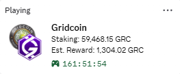

# Gridcoin Discord Rich Presence

A lightweight daemon and portable Windows utility that shows your live Gridcoin staking status, estimated pending reward, and time since last stake directly on your Discord profile.

[](https://github.com/nikolaevichsmor/Gridcoin-RPC/actions/workflows/tests.yml)
[](https://www.python.org/downloads/)
[](https://discord.com/)
[](https://gridcoin.us/)
[](https://opensource.org/licenses/MIT)

---

## Preview



- **Staking**: Active staking coin balance with thousands separators.
- **Est. Reward**: Pending researcher reward matching the value shown in your Gridcoin wallet.
- **Elapsed Timer**: Live timer counting up from your last confirmed stake transaction.
- **GitHub Button**: Links directly to this repository.
- **Auto-Reconnect**: If your wallet is closed or restarted, the status updates to `Wallet Offline` and reconnects as soon as the wallet opens.

---

## Quick Start (Windows Portable)

The easiest way to run the daemon on Windows:

1. Download **`Gridcoin-RPC-v1.0-win64.zip`** from [Releases](https://github.com/nikolaevichsmor/Gridcoin-RPC/releases).
2. Unzip the archive to any folder.
3. Make sure your Gridcoin wallet is open.
4. Launch `Gridcoin-RPC.exe`.

It automatically reads your RPC credentials from `%APPDATA%\GridcoinResearch\gridcoinresearch.conf`, places an icon in your system tray (near the clock), and starts broadcasting to Discord.

### System Tray Controls
Right-click the Gridcoin icon in your tray to:
- **Turn Off / On Presence**: Pause or resume Discord broadcasting without closing the app.
- **GitHub Repository**: Open this project page in your browser.
- **Quit**: Clear your Discord status and exit.

---

## Running from Source (Python)

If you prefer running from Python source on Windows, Linux, or macOS:

### 1. Requirements
- Python 3.8+
- Gridcoin core wallet running locally with RPC enabled (`server=1` in `gridcoinresearch.conf`)
- Discord desktop app running

### 2. Setup
```bash
git clone https://github.com/nikolaevichsmor/Gridcoin-RPC.git
cd Gridcoin-RPC
pip install -r requirements.txt
```

### 3. Run
- **Direct run**:
  ```bash
  python main.py
  ```
- **Silent background run (Windows)**:
  Double-click `scripts/start_background.bat`. To stop, double-click `scripts/stop_background.bat` or use the tray icon.
- Logs are written to `daemon.log`.

---

## Configuration (Optional)

By default, the application automatically locates your `gridcoinresearch.conf` on Windows, Linux, and macOS. 

If your wallet runs on a non-standard port or remote machine, create a `.env` file from the provided template:

```bash
cp .env.example .env
```

Available variables:

| Variable | Description | Default |
| :--- | :--- | :--- |
| `DISCORD_CLIENT_ID` | Discord Application ID | Pre-configured Gridcoin app |
| `RPC_USER` | RPC username | Auto-detected from `gridcoinresearch.conf` |
| `RPC_PASSWORD` | RPC password | Auto-detected from `gridcoinresearch.conf` |
| `RPC_HOST` | Gridcoin node IP | `127.0.0.1` |
| `RPC_PORT` | Gridcoin RPC port | `15715` |
| `UPDATE_INTERVAL` | Status refresh interval in seconds | `15` (minimum to respect Discord rate limits) |

---

## Testing

Run the included test suite:

```bash
python -m unittest test_daemon.py
```

---

## License

MIT License. See [LICENSE](LICENSE) for details.

